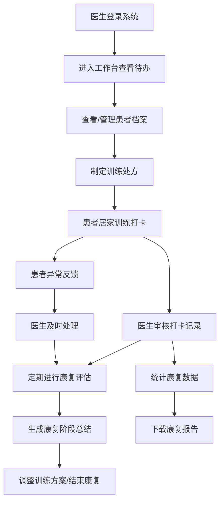

## 1. 产品概述

医院居家康复指导平台是一款面向康复科医生的专业医疗管理系统，旨在帮助医生远程管理术后和慢病康复患者，提供全方位的康复训练指导与跟踪服务。

- 核心价值：打通院内治疗与居家康复的信息壁垒，提高康复管理效率，降低患者复诊成本，提升康复效果
- 目标用户：康复科医生、康复治疗师、患者家属

## 2. 核心功能

### 2.1 用户角色

| 角色 | 登录方式 | 核心权限 |
|------|---------|---------|
| 康复科医生 | 账号密码登录 | 患者管理、处方制定、评估记录、数据分析、报告下载 |
| 患者（关联） | 通过移动端访问 | 查看训练计划、视频打卡、异常反馈、在线咨询 |
| 家属（授权） | 授权码查看 | 查看患者康复进度、接收提醒通知 |

### 2.2 功能模块

1. **工作台**：今日待办、患者概览、康复统计、未打卡提醒、异常告警
2. **患者档案**：患者信息管理、分组管理、风险分级、家属授权管理
3. **训练处方**：康复动作库、训练计划配置、频次设定、疼痛问卷设置
4. **打卡管理**：患者视频打卡审核、动作完成确认、异常反馈处理
5. **评估中心**：量表评估、关节活动度记录、阶段总结
6. **沟通中心**：在线答疑、复诊预约、消息通知
7. **数据统计**：康复进度曲线、治疗效果分析、报告导出下载

### 2.3 页面详情

| 页面名称 | 模块名称 | 功能描述 |
|---------|---------|---------|
| 工作台 | 数据概览卡片 | 显示在管患者数、今日打卡数、待处理评估、异常反馈等核心指标 |
| 工作台 | 今日待办列表 | 待审核打卡、待回复咨询、待确认评估、待复诊预约 |
| 工作台 | 未打卡提醒 | 显示连续未打卡患者列表，支持一键发送提醒 |
| 工作台 | 康复趋势图表 | 展示近7/30天整体康复数据趋势 |
| 工作台 | 异常告警 | 实时显示患者异常反馈和风险预警 |
| 患者档案 | 患者列表 | 支持按分组、风险等级、康复阶段筛选患者 |
| 患者档案 | 患者详情 | 基本信息、病史、康复计划、历史评估、打卡记录完整视图 |
| 患者档案 | 分组管理 | 创建/编辑/删除患者分组，批量分配患者 |
| 患者档案 | 风险分级 | 根据患者数据自动/手动设置风险等级（低/中/高） |
| 患者档案 | 家属授权 | 生成授权码，管理家属查看权限 |
| 训练处方 | 动作库管理 | 上传康复动作视频/图片，设置动作描述、难度、目标部位 |
| 训练处方 | 处方制定 | 为患者选择动作、配置组数/次数/频次、训练周期 |
| 训练处方 | 疼痛问卷 | 配置NRS/VAS疼痛问卷，设置评估节点 |
| 训练处方 | 处方模板 | 保存常用处方为模板，快速复用 |
| 打卡管理 | 打卡列表 | 按日期/患者/状态筛选打卡记录 |
| 打卡管理 | 视频审核 | 播放患者打卡视频，确认动作完成质量 |
| 打卡管理 | 异常处理 | 查看异常反馈，给出处理建议并记录 |
| 评估中心 | 量表评估 | 标准化康复量表（Fugl-Meyer、Berg、Barthel等）在线评估 |
| 评估中心 | 关节活动度 | 记录各关节ROM数据，支持历史对比 |
| 评估中心 | 阶段总结 | 按康复阶段生成总结报告 |
| 沟通中心 | 在线答疑 | 医生与患者实时图文沟通，支持图片上传 |
| 沟通中心 | 复诊预约 | 设置复诊计划，发送预约提醒 |
| 沟通中心 | 消息通知 | 系统通知、打卡提醒、评估提醒统一管理 |
| 数据统计 | 康复进度曲线 | 单个患者多维度康复指标趋势图 |
| 数据统计 | 科室统计 | 分组/全科室患者康复数据对比分析 |
| 数据统计 | 报告导出 | 生成PDF格式康复报告，支持下载 |

## 3. 核心流程

## 4. 用户界面设计

### 4.1 设计风格

- **主色调**：专业医疗蓝 #165DFF（信任、专业），配合深青色 #0E7368（健康、生命）
- **辅助色**：警示橙 #FF7D00（提醒）、危险红 #F53F3F（告警）、成功绿 #00B42A（正常）
- **中性色**：浅灰背景 #F5F7FA，深灰文字 #1D2129，中灰 #4E5969
- **按钮风格**：圆角矩形（8px），主按钮填充色，次按钮描边风格
- **字体**：标题使用思源黑体 SemiBold，正文使用思源黑体 Regular，支持清晰的医疗信息展示
- **布局风格**：左侧导航栏 + 顶部状态栏 + 主内容区的经典医疗后台布局，卡片式内容展示
- **图标风格**：使用 Lucide React 线性图标，保持简洁专业

### 4.2 页面设计概览

| 页面名称 | 模块名称 | UI元素 |
|---------|---------|--------|
| 工作台 | 数据概览 | 渐变背景统计卡片，数字动画，图标+数值+环比 |
| 工作台 | 待办列表 | 标签式分类，图标+标题+数量徽章，hover高亮 |
| 工作台 | 趋势图表 | 平滑折线图，区域渐变填充，多系列对比 |
| 患者档案 | 患者列表 | 表格+筛选器，头像+姓名+风险标签，行内操作 |
| 患者档案 | 患者详情 | 多Tab布局，信息分组卡片，时间轴历史记录 |
| 训练处方 | 动作库 | 网格卡片布局，视频缩略图，难度标签 |
| 训练处方 | 处方配置 | 分步表单，拖拽排序动作，滑块配置频次 |
| 打卡管理 | 打卡审核 | 视频播放器+评分面板，左右分栏布局 |
| 评估中心 | 量表评估 | 问卷式布局，进度条指示，单选/多选/量表题 |
| 沟通中心 | 在线答疑 | 聊天式界面，消息气泡，时间分隔线 |
| 数据统计 | 进度曲线 | 多图表联动，可交互时间筛选，数据标签 |

### 4.3 响应式设计

- 桌面端优先（1440px+），适配医疗工作站大屏
- 支持平板（1024px）横向显示，导航栏可折叠
- 元素间距、字体大小采用响应式单位
- 表格支持横向滚动，图表自适应容器宽度

### 4.4 动效与交互

- 页面加载：卡片依次淡入上滑（stagger animation）
- 数据更新：数字滚动动画，图表渐进式绘制
- 按钮交互：hover状态轻微放大+阴影加深，点击涟漪效果
- 页面切换：路由切换时内容区淡入过渡
- 通知提醒：右上角Toast滑入，异常告警脉冲动画
