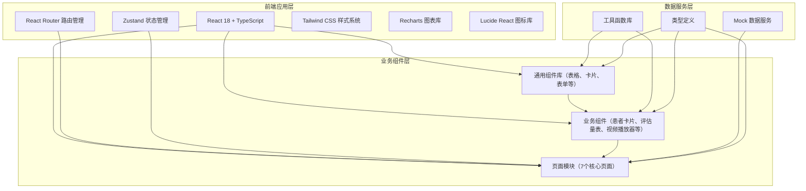
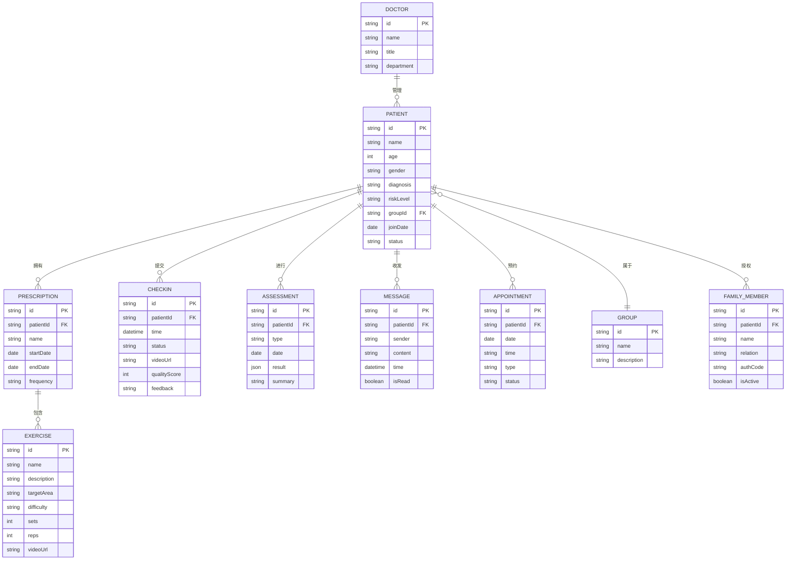

## 1. 架构设计



## 2. 技术描述

- **前端框架**：React@18 + TypeScript@5
- **构建工具**：Vite@5
- **路由管理**：react-router-dom@6
- **状态管理**：zustand@4
- **样式框架**：tailwindcss@3
- **图表可视化**：recharts@2
- **图标库**：lucide-react@0.344
- **数据模拟**：前端内置 Mock 数据（无需后端）

## 3. 路由定义

| 路由 | 页面 | 说明 |
|------|------|------|
| /dashboard | 工作台 | 首页默认路由，数据概览与待办 |
| /patients | 患者档案 | 患者列表与管理 |
| /patients/:id | 患者详情 | 单个患者完整信息 |
| /prescriptions | 训练处方 | 动作库与处方制定 |
| /checkins | 打卡管理 | 打卡记录审核 |
| /assessments | 评估中心 | 量表与ROM评估 |
| /communication | 沟通中心 | 在线答疑与复诊预约 |
| /statistics | 数据统计 | 康复进度与报告 |

## 4. 数据模型

### 4.1 核心实体关系



### 4.2 主要数据结构

```typescript
// 患者
interface Patient {
  id: string;
  name: string;
  age: number;
  gender: '男' | '女';
  avatar?: string;
  phone: string;
  diagnosis: string;
  surgeryDate?: string;
  riskLevel: 'low' | 'medium' | 'high';
  groupId: string;
  stage: '早期' | '中期' | '后期' | '维持期';
  joinDate: string;
  status: 'active' | 'paused' | 'discharged';
  checkinStreak: number;
  lastCheckinDate?: string;
  familyMembers: FamilyMember[];
}

// 训练处方
interface Prescription {
  id: string;
  patientId: string;
  patientName: string;
  name: string;
  exercises: PrescriptionExercise[];
  startDate: string;
  endDate: string;
  frequency: string;
  painSurveyConfig?: PainSurveyConfig;
  createdAt: string;
  status: 'active' | 'completed' | 'paused';
}

// 打卡记录
interface Checkin {
  id: string;
  patientId: string;
  patientName: string;
  date: string;
  time: string;
  videoUrl?: string;
  exercisesCompleted: {
    exerciseId: string;
    exerciseName: string;
    completed: boolean;
    quality?: number;
    notes?: string;
  }[];
  painLevel?: number;
  abnormalFeedback?: string;
  status: 'pending' | 'approved' | 'rejected';
  doctorFeedback?: string;
  reviewedAt?: string;
}

// 评估记录
interface Assessment {
  id: string;
  patientId: string;
  patientName: string;
  type: 'fugl_meyer' | 'berg' | 'barthel' | 'rom' | 'stage_summary';
  typeName: string;
  date: string;
  scores: Record<string, number>;
  totalScore: number;
  romData?: RomRecord[];
  summary: string;
  doctorName: string;
}
```

## 5. 项目结构

```
src/
├── components/           # 通用组件
│   ├── Layout/          # 布局组件
│   ├── ui/              # 基础UI组件
│   └── charts/          # 图表组件
├── pages/               # 页面组件
│   ├── Dashboard/
│   ├── Patients/
│   ├── Prescriptions/
│   ├── Checkins/
│   ├── Assessments/
│   ├── Communication/
│   └── Statistics/
├── store/               # Zustand状态管理
├── types/               # TypeScript类型定义
├── utils/               # 工具函数
├── mock/                # Mock数据
├── hooks/               # 自定义Hooks
├── App.tsx
├── main.tsx
└── index.css
```

## 6. 状态管理设计

```typescript
// 全局状态
interface AppState {
  // 用户
  currentDoctor: Doctor;
  
  // 患者数据
  patients: Patient[];
  selectedPatient: Patient | null;
  groups: Group[];
  
  // 处方数据
  prescriptions: Prescription[];
  exercises: Exercise[];
  
  // 打卡数据
  checkins: Checkin[];
  pendingCheckins: Checkin[];
  
  // 评估数据
  assessments: Assessment[];
  
  // 消息数据
  messages: Message[];
  appointments: Appointment[];
  
  // UI状态
  loading: boolean;
  notifications: Notification[];
}
```
